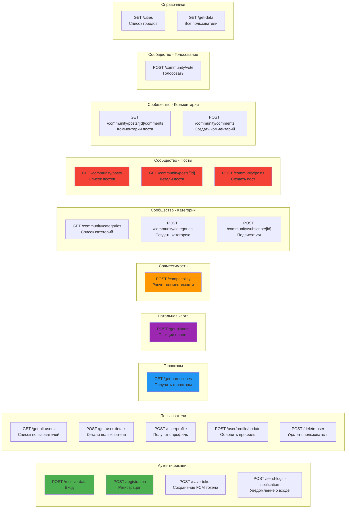
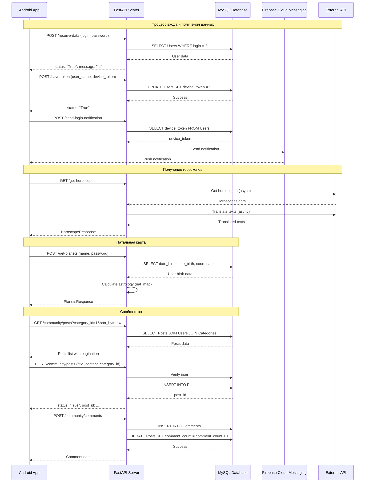

# API Endpoints - Схема взаимодействия

## Схема API endpoints

## Детальная схема API

## Группировка endpoints по функциональности

### 🔐 Аутентификация и авторизация
- `POST /receive-data` - Вход в систему
- `POST /registration` - Регистрация нового пользователя
- `POST /save-token` - Сохранение FCM токена устройства
- `POST /send-login-notification` - Отправка уведомления о входе

### 👤 Управление пользователями
- `GET /get-all-users` - Получить список всех пользователей (админ)
- `POST /get-user-details` - Получить детали пользователя
- `POST /user/profile` - Получить профиль пользователя
- `POST /user/profile/update` - Обновить профиль
- `POST /delete-user` - Удалить пользователя (админ)

### 🔮 Гороскопы
- `GET /get-horoscopes` - Получить гороскопы для всех знаков зодиака

### 🌟 Натальная карта
- `POST /get-planets` - Получить позиции планет в натальной карте

### 💑 Совместимость
- `POST /compatibility` - Рассчитать совместимость двух пользователей

### 👥 Сообщество

#### Категории
- `GET /community/categories` - Список категорий
- `POST /community/categories` - Создать категорию
- `POST /community/subscribe/{category_id}` - Подписаться на категорию

#### Посты
- `GET /community/posts` - Список постов (с фильтрацией и пагинацией)
- `GET /community/posts/{post_id}` - Детали поста
- `POST /community/posts` - Создать пост

#### Комментарии
- `GET /community/posts/{post_id}/comments` - Комментарии поста
- `POST /community/comments` - Создать комментарий

#### Голосование
- `POST /community/vote` - Голосовать за пост/комментарий

### 📋 Справочники
- `GET /cities` - Список городов
- `GET /get-data` - Получить все данные (тестовый endpoint)

