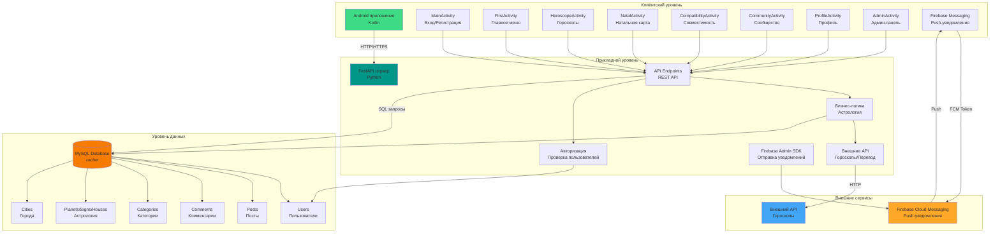

# Архитектура системы Natal

## Общая архитектура системы

## Компоненты системы

### Клиентский уровень (Android)
- **MainActivity**: Экран входа и регистрации
- **FirstActivity**: Главное меню приложения
- **HoroscopeActivity**: Просмотр гороскопов с кэшированием
- **NatalActivity**: Отображение натальной карты
- **CompatibilityActivity**: Расчет совместимости
- **CommunityActivity**: Сообщество с постами и комментариями
- **ProfileActivity**: Управление профилем
- **AdminActivity**: Административная панель
- **Firebase Messaging**: Получение push-уведомлений

### Прикладной уровень (FastAPI)
- **API Endpoints**: REST API для всех операций
- **Бизнес-логика**: Расчеты астрологии, совместимости
- **Авторизация**: Проверка пользователей и прав доступа
- **Firebase Admin SDK**: Отправка push-уведомлений
- **Внешние API**: Интеграция с сервисами гороскопов

### Уровень данных (MySQL)
- **Users**: Пользователи системы
- **Posts**: Посты сообщества
- **Comments**: Комментарии к постам
- **Categories**: Категории постов
- **Planets/Signs/Houses**: Астрологические данные
- **Cities**: Города для расчета координат
