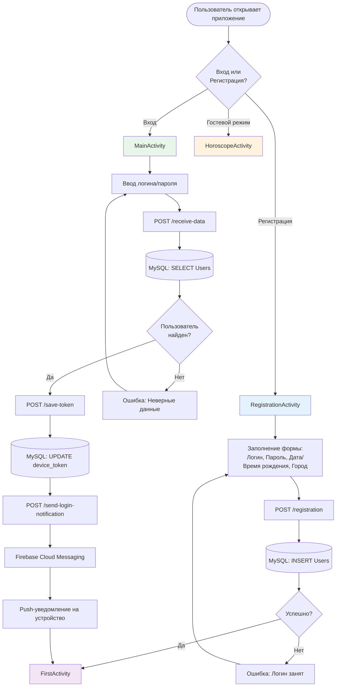
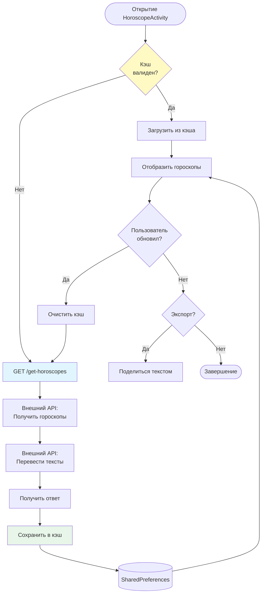
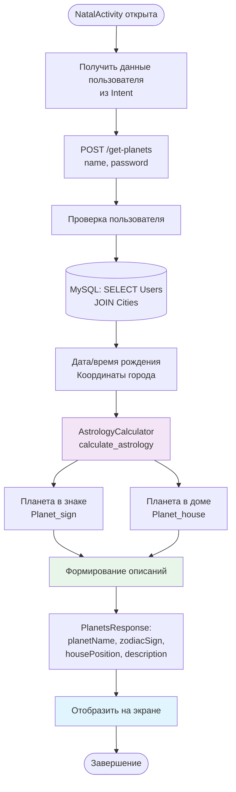
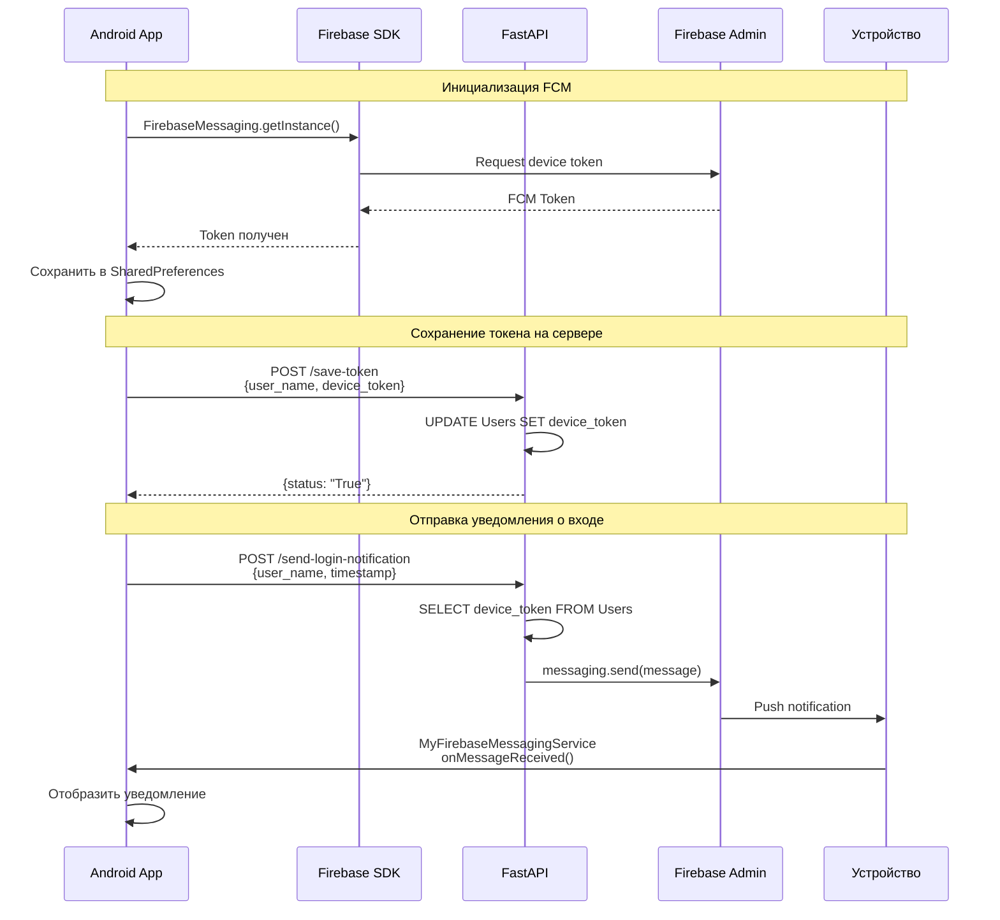
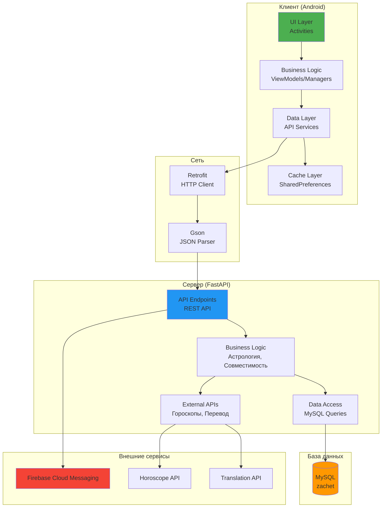

# Потоки данных в системе

## Основные потоки данных

### 1. Процесс регистрации и входа



### 2. Получение и кэширование гороскопов



### 3. Расчет натальной карты



### 4. Работа с сообществом

```mermaid
flowchart TD
    Start([CommunityActivity]) --> LoadCats[GET /community/categories]
    LoadCats --> DisplayCats[Отобразить категории]
    
    DisplayCats --> UserAction{Действие<br/>пользователя?}
    
    UserAction -->|Просмотр постов| LoadPosts[GET /community/posts<br/>category_id, sort_by, page]
    LoadPosts --> DB1[(MySQL: SELECT Posts<br/>JOIN Users, Categories)]
    DB1 --> DisplayPosts[Отобразить посты]
    
    DisplayPosts --> PostAction{Действие с<br/>постом?}
    PostAction -->|Открыть| PostDetail[GET /community/posts/{id}]
    PostDetail --> LoadComments[GET /community/posts/{id}/comments]
    LoadComments --> DB2[(MySQL: SELECT Comments<br/>JOIN Users)]
    DB2 --> DisplayComments[Отобразить комментарии]
    
    PostAction -->|Создать| CreatePost[POST /community/posts]
    CreatePost --> Verify1[Проверка пользователя]
    Verify1 --> DB3[(MySQL: INSERT Posts)]
    DB3 --> RefreshPosts[Обновить список]
    
    PostAction -->|Комментировать| CreateComment[POST /community/comments]
    CreateComment --> Verify2[Проверка пользователя]
    Verify2 --> DB4[(MySQL: INSERT Comments<br/>UPDATE comment_count)]
    DB4 --> RefreshComments[Обновить комментарии]
    
    PostAction -->|Голосовать| Vote[POST /community/vote]
    Vote --> Verify3[Проверка пользователя]
    Verify3 --> DB5[(MySQL: UPDATE upvotes/downvotes)]
    DB5 --> RefreshVotes[Обновить голоса]
    
    style LoadPosts fill:#E3F2FD
    style CreatePost fill:#E8F5E9
    style Vote fill:#FFF3E0
```

### 5. Push-уведомления



## Архитектура обработки данных


