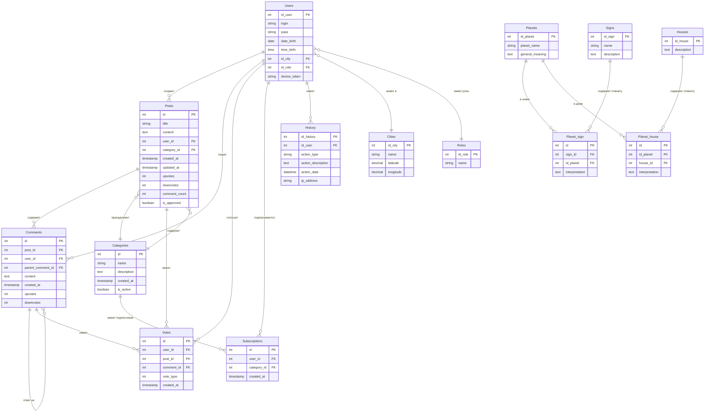

# Схема базы данных

## ER-диаграмма базы данных

## Описание таблиц

### Основные таблицы пользователей

**Users** - Пользователи системы
- Хранит учетные данные (логин, пароль)
- Дата и время рождения для астрологических расчетов
- Связь с городом для определения координат
- Роль пользователя (администратор, пользователь, астролог)
- Токен устройства для push-уведомлений

**Roles** - Роли пользователей
- Администратор
- Пользователь
- Астролог

**Cities** - Города
- Название города
- Географические координаты (широта, долгота)

### Таблицы сообщества

**Posts** - Посты сообщества
- Заголовок и содержание
- Автор (связь с Users)
- Категория
- Система голосования (upvotes/downvotes)
- Количество комментариев
- Модерация (is_approved)

**Comments** - Комментарии
- Содержание комментария
- Связь с постом
- Автор комментария
- Поддержка вложенных комментариев (parent_comment_id)
- Система голосования

**Categories** - Категории постов
- Название и описание
- Активность категории

**Votes** - Голоса
- Голосование за посты и комментарии
- Тип голоса (1 - upvote, -1 - downvote)

**Subscriptions** - Подписки
- Подписки пользователей на категории

### Астрологические таблицы

**Planets** - Планеты
- Название планеты
- Общее значение

**Signs** - Знаки зодиака
- Название знака
- Описание

**Houses** - Дома натальной карты
- Номер дома (1-12)
- Описание значения дома

**Planet_sign** - Планеты в знаках
- Интерпретация планеты в конкретном знаке зодиака

**Planet_house** - Планеты в домах
- Интерпретация планеты в конкретном доме

### Служебные таблицы

**History** - История действий
- Логирование действий пользователей
- Тип действия и описание
- IP-адрес
