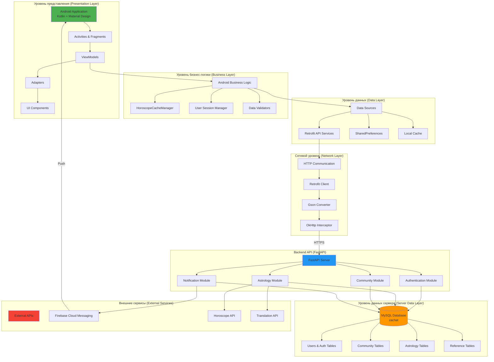
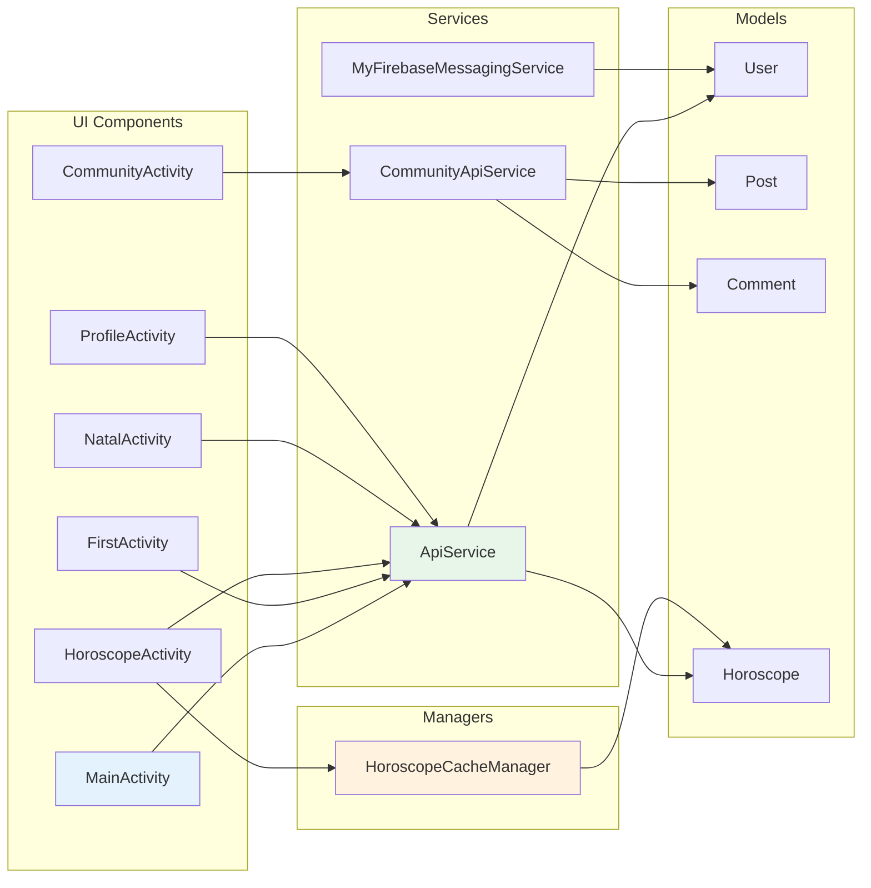
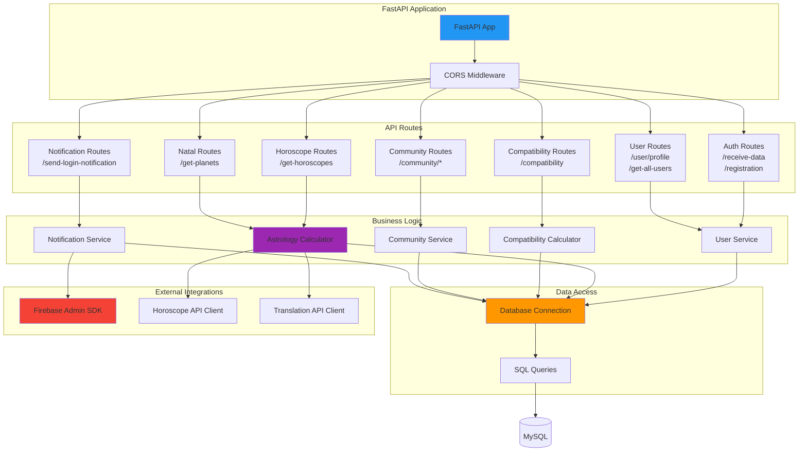
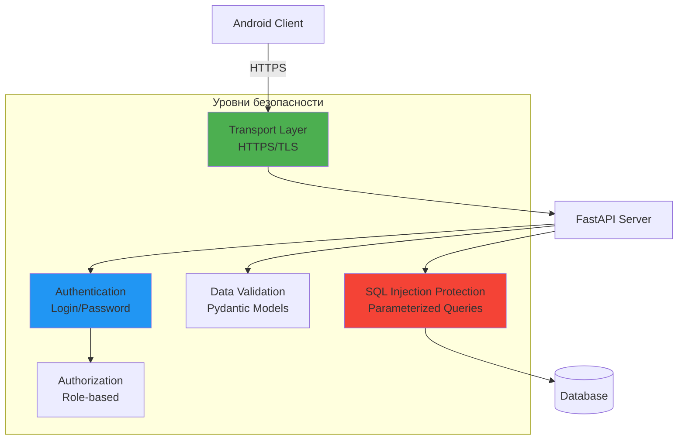
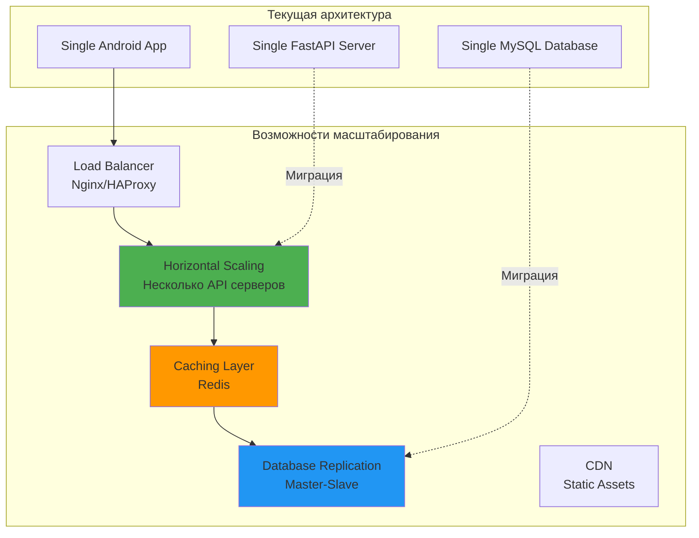

# Системная архитектура приложения Natal

## Общая архитектура системы

## Компонентная архитектура

### Android приложение

### Backend сервер

## Технологический стек

### Клиент (Android)
- **Язык**: Kotlin
- **UI Framework**: Android Views + Material Design
- **Архитектура**: Activity-based (можно мигрировать на MVVM)
- **Сеть**: Retrofit 2.9.0
- **JSON**: Gson
- **Асинхронность**: Kotlin Coroutines
- **Кэширование**: SharedPreferences
- **Push-уведомления**: Firebase Cloud Messaging

### Сервер (Backend)
- **Фреймворк**: FastAPI (Python)
- **База данных**: MySQL (PyMySQL)
- **Валидация**: Pydantic
- **CORS**: FastAPI CORS Middleware
- **Push-уведомления**: Firebase Admin SDK
- **Внешние API**: aiohttp (асинхронные запросы)

### База данных
- **СУБД**: MySQL 5.7+
- **Кодировка**: utf8mb4_unicode_ci
- **Движок**: InnoDB
- **Связи**: Foreign Keys

### Внешние сервисы
- **Firebase Cloud Messaging**: Push-уведомления
- **Horoscope API**: Получение гороскопов
- **Translation API**: Перевод текстов

## Безопасность

## Масштабируемость

